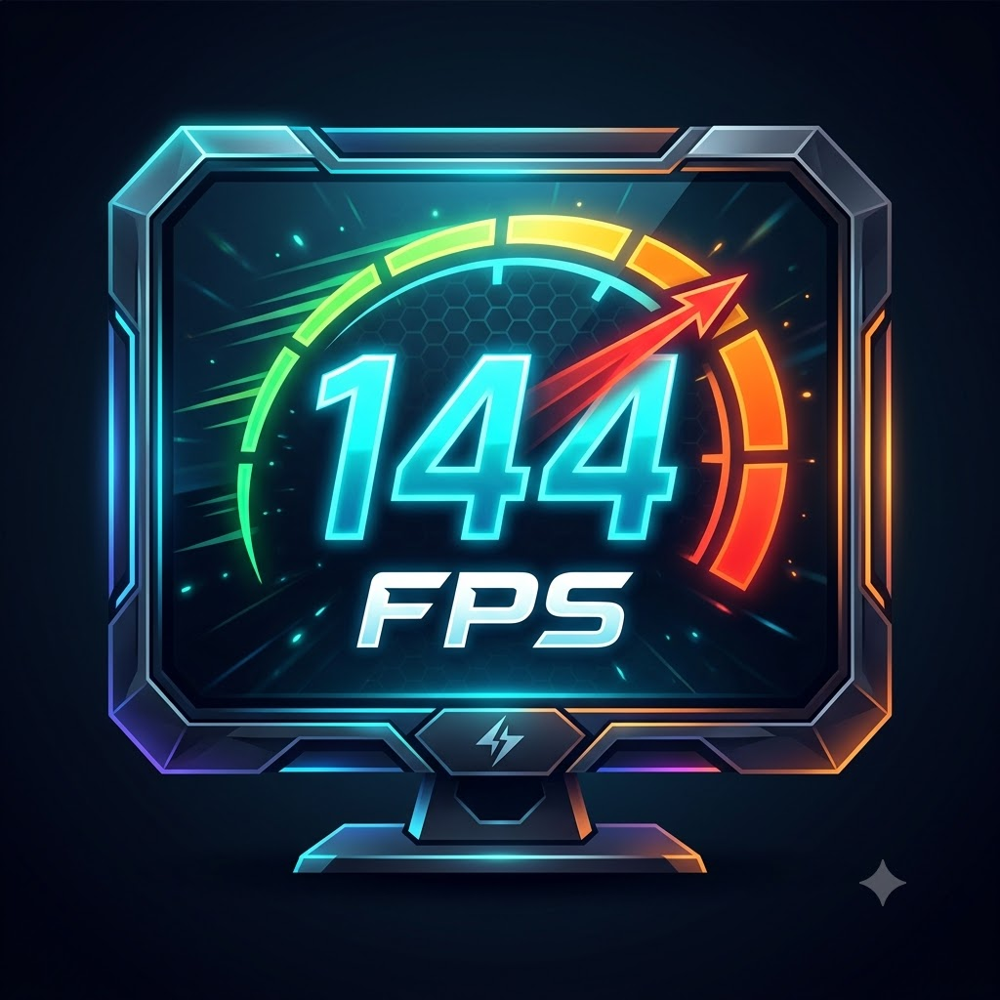

<p align="center">
  
</p>

# FPS Monitor

A customisable FPS / GPU / CPU overlay for Windows — an MSI Afterburner + RivaTuner
replacement built around open telemetry sources rather than estimates.

## How to run

Double-click **`FPS Monitor.bat`**.

Windows will show a UAC prompt. Accept it — Administrator is required for two things:

| Needs admin | Why |
|---|---|
| FPS, frame time, 1% / 0.1% lows | PresentMon opens a realtime ETW trace session |
| CPU temperature, per-core clocks, CPU package power | LibreHardwareMonitor loads a ring0 driver |

Everything else (GPU load, GPU/hotspot/VRAM temperatures, GPU clocks, GPU power,
fan RPM, VRAM usage, RAM) works without elevation.

To run without the UAC prompt: `python run.py --no-elevate`

## What it measures

**FPS is measured, not estimated.** Intel PresentMon reports one event per
presented frame, so the numbers come from the actual present queue — the same
method CapFrameX and OCAT use. If no game is presenting, FPS shows `--` rather
than a made-up value.

Sensors come from LibreHardwareMonitorLib, which talks to the AMD driver
directly for your RX 9060 XT and to the CPU's SMU for the Ryzen 2600X.

## Controls

| Hotkey | Action |
|---|---|
| `Ctrl+Alt+F` | Show / hide the overlay |
| `Ctrl+Alt+B` | Start / stop benchmark recording |
| `Ctrl+Alt+S` | Open settings |
| `Ctrl+Alt+P` | Next profile |

All four are editable in **Settings → Behaviour**. The tray icon has the same
actions plus a profile switcher.

## Customisation

Settings has five tabs:

- **Metrics** — tick any of ~28 metrics, drag to reorder.
- **Appearance** — font, size, bold, colours for values / labels / warning /
  critical, background colour and opacity, text opacity, padding, line spacing,
  corner radius, rows vs columns vs single-line, labels/units/group headers,
  number alignment.
- **Position** — anchor to any screen corner or centre, pick the monitor, set
  margins, or untick **Locked** and drag the overlay wherever you want.
- **Behaviour** — refresh rate, "hide unless a game is rendering", hotkeys,
  benchmark control.
- **Profiles** — save, load, duplicate and delete complete configurations.

Seven profiles ship by default: *Default*, *Minimal FPS*, *Afterburner style*,
*MangoHud*, *Frametime analysis*, *Full telemetry*, *Benchmark bar*.

## Themes and Windows integration

The settings window has a **light and a dark theme** — the toggle is at the
bottom of the sidebar, and the choice is remembered. Both themes are generated
from one stylesheet so they cannot drift apart, and text contrast is checked
against the WCAG AA 4.5:1 threshold by the test suite.

The overlay's own colours stay per-profile: what reads well over a game is a
different question from what reads well in a window.

**Settings → Behaviour → Windows integration** adds a Start Menu entry, which
is what lets Windows Search find the app when you type its name. It is a
per-user shortcut — no installer, nothing system-wide — and Remove takes it
back out.

## Frame-time graph and stutter

**Settings → Graph** enables a graph that plots frame time — one point per
presented frame, not an average. This is the thing to watch for smoothness: a
run can average 144 FPS and still feel bad if individual frames overshoot their
neighbours. A flat line is smooth; isolated tall spikes are micro-stutter.
Frames over 1.5× the median are drawn in the spike colour. Optional guides mark
16.7 ms (60 FPS) and 33.3 ms (30 FPS).

The graph runs on **its own clock**, independent of the sensor poll rate. Each
frame is positioned by its real timestamp, so between repaints the whole trail
slides left by exactly the elapsed time — it scrolls continuously instead of
lurching once per sensor tick. Redraw rate is selectable (15/30/60/120 FPS,
default 60) and only the graph strip is repainted, so the animation is close to
free: measured 64 Hz with 73 of 77 repaints touching just the graph.

The trail dims toward its tail (without disappearing) and has a gradient fill
under the curve, with a leading dot marking *now*. When more frames arrive than
there are pixels, each pixel column keeps the **worst** frame in it, so a single
stutter spike can never be averaged away by the downsampling.

**Vertical scale** follows the 98th percentile, not the maximum. Scaling to the
maximum meant one 47 ms hitch flattened a 9 ms baseline into an unreadable line
along the bottom; spikes past the top are clipped but still drawn, so nothing is
hidden. The scale eases between values rather than snapping.

**Stutter detection** requires a frame to be worse both *relatively* (default
1.8× the median) and *absolutely* (default +5 ms). Requiring only the relative
test marked harmless jitter on a locked framerate — at 110 FPS a 13.7 ms frame
is invisible to the eye but tripped a 1.5× rule. Both figures are adjustable in
Settings → Graph if you still see spikes during smooth gameplay.

Frame history retention automatically tracks the graph window, so the trace
always spans the full width.

**Presentation times are reconstructed, not taken from arrival time.**
PresentMon writes to a pipe, so its stdout is block buffered: roughly 30 CSV
rows land in a single burst about once a second. Stamping each frame with the
moment it was *parsed* collapsed a whole burst onto one x position — at 30 FPS
that turned 120 frames into 4 vertices joined by long straight hinges. The
newest frame is now anchored to its arrival and every earlier frame is placed by
walking backwards through the measured frame intervals. Frame time *is* the gap
between presents, so this rebuilds the true timeline exactly and is immune to
however PresentMon buffers. Where PresentMon provides its own `CPUStartTime`
column it is used directly instead, which stays correct even if rows are
dropped. Confirmed against a real capture: consecutive `CPUStartTime` values
differ by exactly the previous frame's `FrameTime`.

**The graph renders slightly in the past.** Frames arrive about once a second in
bursts, so drawing right up to *now* leaves the last second empty and then fills
it in one jump. The graph instead draws behind real time by an automatically
measured delay (typically ~1.2× the delivery cadence), so every pixel shown is
backed by data that already arrived and the trace scrolls seamlessly. Measured:
the right edge never empties, and after removing the scroll the trail is a pure
translation to within 0.6 ms at the 99th percentile.

Because the graph draws behind real time, it requests `window + delay` seconds
of history rather than `window`. Requesting only the window returns
`[now-window, now]` while the visible span is `[now-delay-window, now-delay]`,
so the leftmost `delay` seconds have nothing to draw — at the 2 s delay cap that
left the whole left half of the graph empty.

**Frame history survives a late burst.** A stream used to be discarded after two
seconds of silence, but bursts can legitimately arrive more than two seconds
apart — so history was thrown away and the graph had to regrow from the right
edge, repeatedly. History is now kept until it ages out of the retention window
entirely; idleness only affects which process is *reported*, never whether its
data is kept.

Two further sources of visible jitter were removed: the clock anchor used to be
corrected on every frame, sliding all points sideways at ~120 Hz, and the
vertical scale had no dead zone so it breathed continuously. `dwm.exe` is also
excluded — the desktop compositor presents constantly and, in a real capture,
produced *more* frames than the game, so it could be reported as your frame rate.

Three numeric companions are available as metrics:

- **MED FT** — median frame time, unaffected by a few bad frames.
- **JITTER** — mean frame-to-frame variation. Under ~1 ms feels smooth.
- **STUTTER** — percentage of frames exceeding 1.5× the median.

## RTSS / Afterburner profile

The *RTSS Afterburner* profile reproduces the RivaTuner on-screen display:
group-coloured labels, orange right-aligned values with the unit in smaller
text beside them, and a bare hairline frame-time graph captioned "Frametime"
with the scale parked in a gutter to the right of the plot.

The graph options that produce that look are all individually settable, so any
profile can adopt part of it: fixed vertical scale (`graph_max_ms`, 16.7 ms here
rather than auto-scaling), no fill, no trail fade, no stutter markers, 1 px
line, a caption, and scale label position (left / right / hidden). "Units in
smaller text after the value" and the unit size live under Appearance → Layout.

## MangoHud profile

The *MangoHud* profile mirrors MangoHud's default look: dark translucent panel,
white values, per-group coloured labels (GPU green, CPU blue, VRAM purple, RAM
pink, FPS red) and the frame-time graph underneath. Group colouring is a general
feature — **Settings → Graph → group colours** — so any profile can use it.

### Colour thresholds

Values turn amber then red as they approach their limits (e.g. CPU temp at
75 °C / 90 °C, FPS below 45 / 30). Toggle in Appearance.

## When the overlay shows, and where

**Settings → Behaviour → Show** controls visibility:

- **While a game is running** (default) — the overlay stays on the game even
  when the game does not have focus, so it remains visible on a windowed game
  while you work on another monitor. It hides when the game is minimised.
- **Only while the game has focus** — the stricter behaviour.
- **Whenever anything is rendering**, or **Always**.

Deciding "is this a game" cannot be done by "is it presenting frames" — a
browser playing video presents continuously, and so does the desktop
compositor. The test is: the focused window is presenting frames **and** its
executable is not on the known non-game list (browsers, Explorer, Discord,
editors, launchers, media players). Two text boxes let you force any executable
into or out of that list.

**Settings → Position → follow the game's window** anchors the overlay to the
game's client area rather than the screen, so a windowed game keeps the overlay
on top of it as you move or resize. Fullscreen games fall back to the screen
corner automatically. If you drag the overlay while unlocked, the offset is
remembered relative to the window.

## FPS limiter

Capping another process's frame rate requires code inside its render loop.
This app will not inject a DLL into games — that is how anti-cheat bans happen
— so it offers the two routes that do not require it. **Both are optional; the
app works fine without either.**

**1. RivaTuner Statistics Server (if you have it).** Driven through RTSS's own
profile API (`RTSSHooks64.dll`: `LoadProfile` / `SetProfileProperty` /
`SaveProfile` / `UpdateProfiles`). Limits apply immediately with no restart.

Editing RTSS's `.cfg` files directly does **not** work, which is worth knowing
if you ever try it: RTSS holds profiles in memory and rewrites the files later.
Measured on a real install, one profile read `60` through the API while the file
on disk said `0`.

Two things to be aware of:

- **Saving requires Administrator**, because RTSS keeps its profiles under
  Program Files. Without it `SetProfileProperty` succeeds in memory but
  `SaveProfile` silently fails and the value reverts. The app checks writability
  directly and says so rather than pretending it worked.
- **A per-game profile overrides Global.** Setting a Global cap does nothing for
  a game that has its own profile, so the app lists the games that would ignore
  it.

Run `Test FPS limiter.bat` to verify the whole path end to end. It writes only
to a throwaway profile name and removes it afterwards.

**2. Your GPU driver.** No third-party software at all: AMD Software →
Gaming → Graphics → Advanced → Max FPS (or Radeon Chill), NVIDIA Control Panel →
Manage 3D settings → Max Frame Rate. The FPS limiter page detects your GPU
vendor and opens the right control panel.

## Overlay behaviour in games

The overlay is a click-through, always-on-top layered window. It appears over
**borderless-windowed and windowed** games, which is how nearly all modern games
run. It cannot draw inside a game using **exclusive fullscreen** — no external
window can, without injecting into the game's renderer.

If a game is exclusive-fullscreen only, switch it to borderless windowed.

The overlay keeps itself above the game without flickering: it is marked
`WS_EX_NOACTIVATE` so it never takes focus, and its z-order is only re-asserted
when another window has actually covered it (detected instantly via a
`SetWinEventHook` on foreground changes). Column widths are sticky and the
window is only resized or moved when its geometry genuinely changes, so a
number gaining a digit does not cause a repaint of the whole panel.

## Benchmarking

`Ctrl+Alt+B` starts a recording. Every sample is written to
`logs\bench_<app>_<timestamp>.csv`, and a summary block (average / min / max /
1st and 5th percentile FPS, temperatures, power) is appended when you stop.

## Project layout

```
FPS Monitor.bat              launch (asks for Administrator)
Test FPS limiter.bat         verify the RTSS limiter end to end
Diagnose PresentMon.bat      capture how PresentMon delivers frames
Fix FPS (clear stuck session).bat   clear an orphaned ETW session
run.py                       entry point, self-elevating

fpsmon/
  app.py          wiring: tray, hotkeys, update loop, visibility
  overlay.py      the transparent overlay and frame-time graph
  settings_ui.py  the control panel
  theme.py        dark theme stylesheet
  sensors.py      LibreHardwareMonitor backend -> metric dict
  fps.py          PresentMon reader -> fps / frametime / lows
  focus.py        which window is a game, and where it is
  limiter.py      RTSS profile API + driver-panel fallback
  metrics.py      metric registry: labels, units, formatting, thresholds
  config.py       profiles and presets (JSON)
  bench.py        CSV benchmark recorder
  hotkeys.py      global hotkeys via RegisterHotKey

vendor/           LibreHardwareMonitorLib.dll, HidSharp.dll, PresentMon.exe
assets/           logo.png / icon.ico (see tools/make_icon.py)
tests/            run_all.py runs all nine suites
tools/            icon builder, preview renderer, diagnostics

profiles/  logs/  state.json      created at runtime, not in version control
```

Run the test suite with:

```
python tests\run_all.py
```

## Startup time

The window appears in about 1.1 s. LibreHardwareMonitor's `Open()` costs
roughly 3 s on its own, so it is not on the startup path: both the sensor
backend and PresentMon initialise on background threads and readings fill in
after a couple of seconds. Motherboard (Super-I/O) and controller (SMBus)
probing is disabled — it accounted for ~0.9 s and supplied nothing displayed
here.

## Building a release

```
powershell -ExecutionPolicy Bypass -File tools\build.ps1
```

Produces `dist\FPS Monitor\` (~121 MB, 335 files), a zip of ~51 MB, and a
SHA-256 file to publish beside the download.

It is a **one-folder** build, not one-file. A one-file build unpacks itself to
a temp directory on every launch, which would undo the work spent getting
startup to ~1.1 s, and it triggers antivirus heuristics more often.

The exe embeds `requireAdministrator`, so Windows elevates before the process
starts — needed for PresentMon's ETW session and LibreHardwareMonitor's driver.

To verify a build without a UAC prompt:

```
set FPSMON_SELFTEST=1
python -m PyInstaller --noconfirm --clean --distpath dist-selftest FPSMonitor.spec
"dist-selftest\FPS Monitor selftest\FPS Monitor selftest.exe" --selftest
```

That produces a console build with no elevation manifest and checks that the
bundle can find `vendor/` and `assets/`, that pythonnet loads
LibreHardwareMonitor, and that the data folder is writable.

### Expect antivirus warnings

An unsigned executable that loads a ring0 driver and opens ETW sessions looks
like malware to heuristics. SmartScreen will warn until the download builds
reputation. Publish the SHA-256, and sign the binary if you can.

## Requirements

Python 3.11+, plus: `PySide6 pythonnet psutil keyboard pywin32`
(`pip install PySide6 pythonnet psutil keyboard pywin32`)
